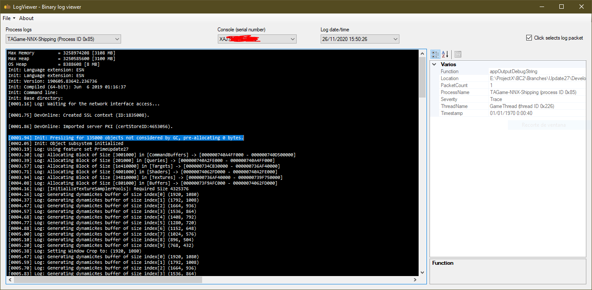

# LogViewer

> Simple but useful UI to read Nintendo binary log files.

## BinaryLog

> Simple .NET library for reading/parsing Nintendo binary log files.

Supports any valid *.nxbinlog file, opening a directory will scan all binary logs with the correct format they're generated with.

# Credits

The project's icon is from [flaticon](https://www.flaticon.com).